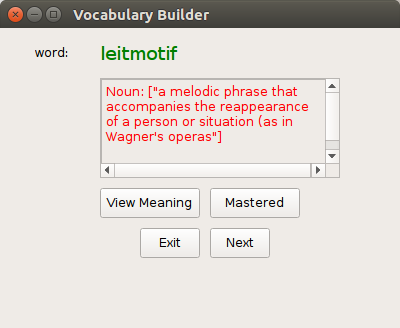

Hi! Welcome to Vocabulary Builder !
===================================
If you read a lot and that too on kindle then I'm sure you know vocabulary builder where the words which we look up for meaning are stored.

**Note:**These words are stored in a database named **vocab.db** in kindle documents file

So I have tried to make a simple GUI in pyhton using PyQt5 to access those words and get their meaning displayed.

This is the simple UI of Vocabulary-Builder
 

